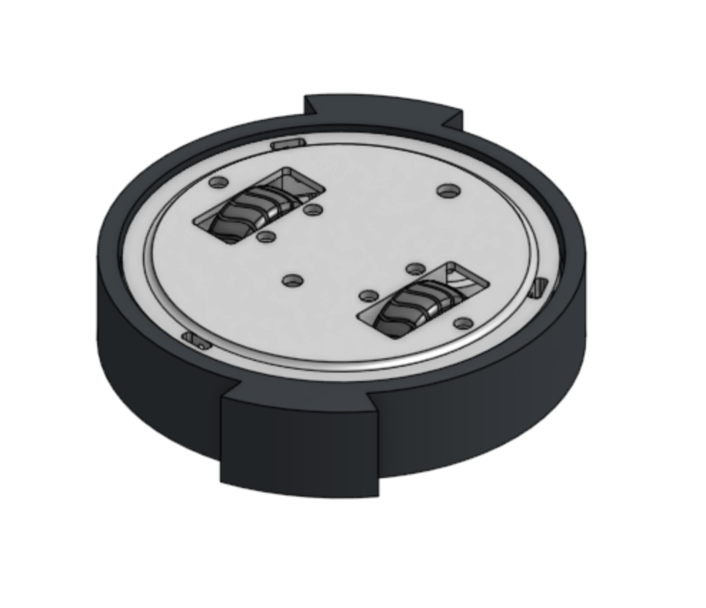
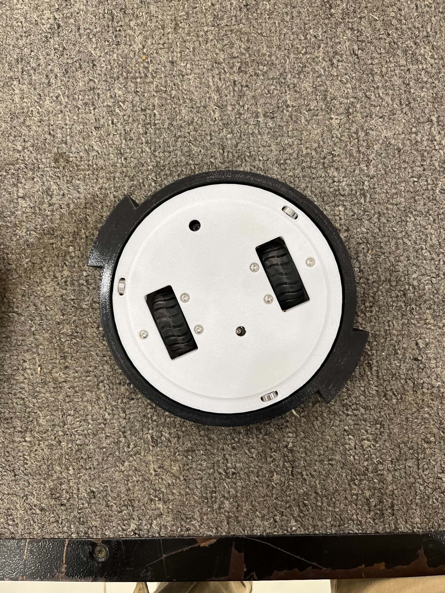
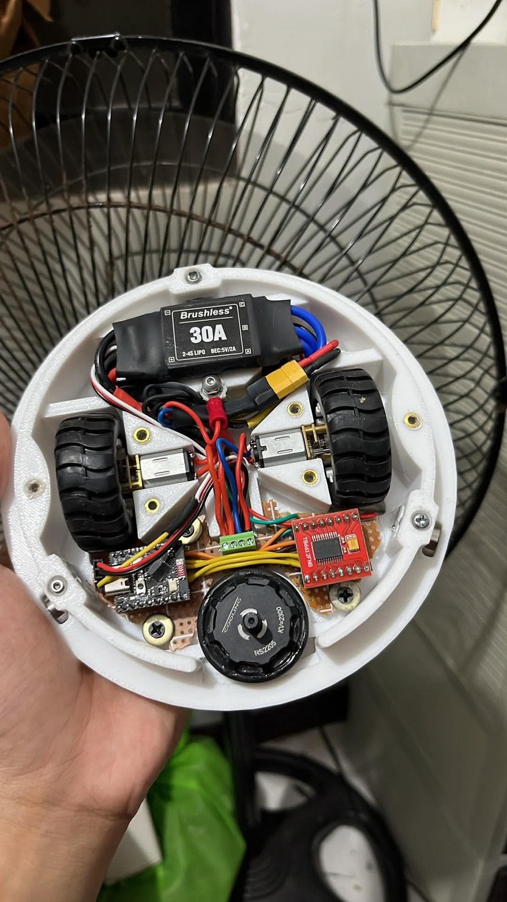
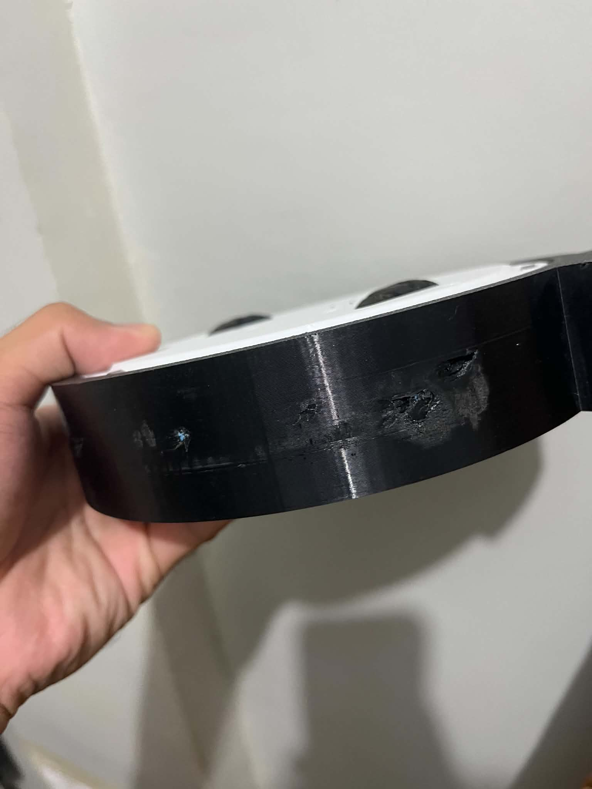
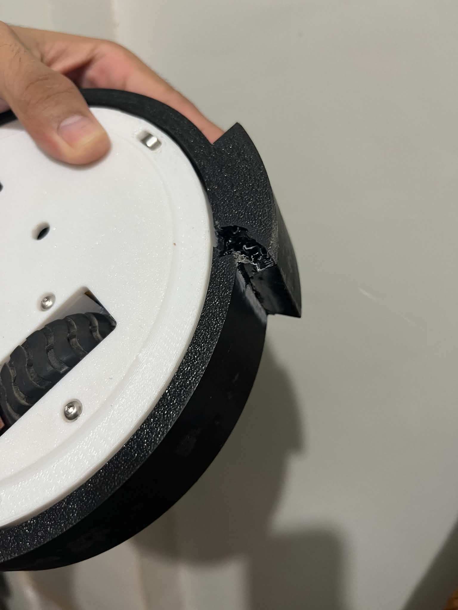

# Spin the IRON

**Spin the IRON** is a custom-engineered ring-spinner combat robot built for 600g combat robot category. Originally designed with ESP32 microcontroller, the robot utilizes a custom 3D-printed chassis, independent tank steering, and a high-kinetic friction-drive weapon system.

Following a strong 4th-place finish at the SMARRT (Science-Based Mechatronics, Autonomous Robotics, and Research Tournament) Palawan 2026 competition, this repository documents the robot's V1 build, combat performance, and the comprehensive V2 engineering upgrades planned to maximize its destructive power and arena reliability.

---

## Working Mechanism

The V1 iteration of _Spin the IRON_ relies on three primary systems:

- **The Weapon Drive (Friction Ring Spinner):** The primary weapon is a 3D-printed PETG external ring driven by a 2205 Brushless DC (BLDC) outrunner motor. A rubber O-ring wrapped around the motor bell generates friction against the inner track of the weapon ring to transfer kinetic energy.
- **The Mobility System (Arcade Tank Drive):** The robot is propelled by two independent N20 brushed gearmotors. Steering logic is calculated via algorithmic "Arcade Drive" mixing, translating X and Y joystick inputs into forward/reverse and differential turning speeds.
- **The Control Protocol (ESP-NOW):** The initial control system bypassed standard Wi-Fi routers using ESP-NOW—a direct, peer-to-peer Wi-Fi protocol polling joystick data and transmitting control packets to an ESP32-C3 receiver.

---

## Schematic & Wiring

Click the links below to view or download all PDF Schematics

[Transmitter joystick and ESP32 Schematic](./docs/transmitter-schematic.pdf)

[Spin the IRON Schematic](./docs/spin-the-iron-schematic.pdf)

---

## Firmware

The control firmware for _Spin the IRON_ is split into two distinct components: the transmitter logic and the receiver logic. All associated source code can be found within the `src` directory.

---

## Bill of Materials (BOM)

This table outlines the original V1 components alongside the newly specified V2 upgrades.

| Component Category   | V1 Build (Current)            | V2 Upgrade (Planned)                       |
| :------------------- | :---------------------------- | :----------------------------------------- |
| **Control System**   | ESP32 & ESP32-C3 (ESP-NOW)    | FlySky FS-i6 & FS-iA6B Receiver            |
| **Weapon Motor**     | 2205 BLDC Outrunner (2300 KV) | D2822 Outrunner (1100KV–1450KV)            |
| **Weapon Drive**     | Rubber O-Ring Friction Drive  | GT2 Timing Belt & 3D Printed Pulley        |
| **Drive Motors**     | 12V N20 Brushed Gearmotors    | 12V N20 Brushed Gearmotors                 |
| **Drive Control**    | Custom ESP32 PWM Output       | Dual Way 5A Brushed ESC (Independent Mode) |
| **Chassis Material** | PETG Filament                 | TPU (Flexible) Filament                    |
| **Weapon Material**  | PETG Filament                 | Carbon Fiber Nylon / Polycarbonate         |
| **Power Supply**     | 3S (11.1V) LiPo Battery       | 3S (11.1V) LiPo Battery                    |

---

## 3D Model (Onshape)

- _Link:_ [Spin the IRON - Main Assembly](https://cad.onshape.com/documents/5bef921955e97372b21f3869/w/19c6b58bd35384c7ee4e993e/e/0ef98a1e93d77f2e0019060d?renderMode=0&uiState=6aaa8c0c7d84702169ae3cfe)

---

## Images

## Images

- _Image 1: External view of the robot._
  

- _Image 2: Internal view of the robot._
  

- _Image 3: Showing the battle-damaged after first match._
  

  _Image 4: Showing the battle-damaged after second match._
  

---

## Match Clips

- _Clip 1: First Match. Spin the IRON vs Zyphra (Horizontal Spinner)_

https://github.com/user-attachments/assets/9445c94e-30c5-4e7d-bc83-72d9ab0b626e

- _Clip 2: Second Match. Spin the IRON vs Jollibot (Drum Spinner)_

https://github.com/user-attachments/assets/ed43bb46-67b6-4195-94c0-906a0569c117

---

## Analysis and Observation

During the SMARRT Palawan 2026 tournament, the robot performed well but revealed five critical failure points under heavy combat stress:

1.  **Delayed Controller:** Despite almost 0ms latency in home testing, the ESP-NOW protocol suffered severe input delay inside the arena. I am suspecting maybe this is due to massive 2.4GHz RF congestion from other players transmitter and spectator smartphones.
2.  **Weapon Ring Activation (Slow Spool-up):** The weapon took too long to "recharge" and reach combat speed. The high-KV 2205 motor lacked the starting torque to instantly spin the ring, requiring a slow throttle ramp-up to prevent sensorless stalling.
3.  **Low Material Durability:** The standard PETG weapon ring completely shattered when subjected to a direct, high-kinetic impact from an opponent's carbon fiber weapon.
4.  **O-Ring Splash & Wear:** The rubber O-ring friction drive constantly slipped during spool-up, melting the rubber. At high RPMs, centrifugal force caused the O-ring to "splash" or fly off the motor bell entirely.
5.  **Component Disconnect:** During the 3rd place match, the snapping O-ring acted as a whip inside the chassis, violently yanking the motor driver directly off its female pin headers and causing a total loss of control.

---

## Recommendations and Improvements

To address the failures observed at the tournament, the **V2 Overhaul** will implement the following engineered solutions:

- **Interference-Proof Control:** Transition entirely from the ESP32 ecosystem to a **FlySky FS-i6** transmitter with an **FS-iA6B** receiver. This utilizes the AFHDS 2A frequency-hopping protocol to punch through venue Wi-Fi noise and provide true zero-latency control.
- **High-Torque Belt Drive:** Replace the friction O-ring with a toothed **GT2 Timing Belt**. The weapon ring will feature an internal gear profile, and a 3D-printed GT2 sleeve will be mounted to the BLDC motor bell to guarantee slip-free kinetic transfer.
- **Motor Down-KVing:** Swap the weapon motor to a **D2822 (1100KV–1450KV)**. This provides massive low-end torque to instantly kick-start the belt-driven weapon without desyncing.
- **Armor Material Overhaul:** Print the main body chassis in flexible, shock-absorbing **TPU**, and upgrade the spinning weapon ring to highly rigid, impact-resistant **Carbon Fiber Nylon**.
- **Bulletproof Electronics:** Integrate a **Dual Way 5A Brushed ESC** set to _Independent Mode_ to control the **12V N20** drive motors (safely handling the 3S battery). Furthermore, all connections will be hard-wired, soldered, or secured on a custom PCB to eliminate female pin headers entirely.

---

_Spin the IRON by ironerae_
